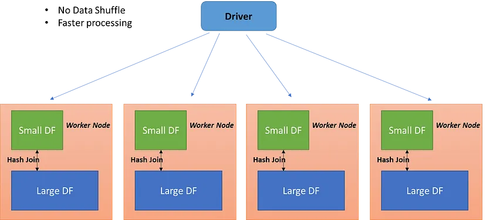

# 7.1 効率化のためのSparkの最適化とチューニング

## 7.1.1 Apache Spark Configurationの表示と設定
Sparkのプロパティを取得・設定する方法は3つある.

1. 設定ファイルのセットを使用
   1. Sparkをインストールした場所(`SPARK_HOMEディレクトリ`)にはいくつかの設定ファイルがある。
   2. これらの各ファイルのデフォルト値を変更し，接尾辞である.templateを付けずに保存すると新しい値を適用される。
   3. なお`conf/spark-defaults.conf`の設定変更はSparkクラスタに送信される。
2. Sparkアプリケーションで直接Sparkの設定を指定
   1. spark-submitで--confフラグを使用して指定できる。
      1. コマンドラインでやる：`spark-submit --conf spark.sql.shuffle.partitions=5`
      2. pythonでやる場合
        ```python
            from pyspark.sql import SparkSession

            # SparkSessionの作成
            spark = SparkSession.builder.appName("ExampleApp").getOrCreate()

            # プロパティを設定
            spark.conf.set("spark.sql.shuffle.partitions", "50")

            # プロパティを取得
            shuffle_partitions = spark.conf.get("spark.sql.shuffle.partitions")

            print(f"spark.sql.shuffle.partitions: {shuffle_partitions}")

            # すべてのプロパティを取得
            all_conf = spark.conf.getAll()
            for key, value in all_conf.items():
                print(f"{key}: {value}")
        ```

3. Spark shellを介した方法
   1. SparkSessionはSparkのエントリポイントとなっているたあめこおからほぼ全ての設置にアクセスできる。
      1. 以下のようにかけば，Spark SQL固有のSpark Configのみを表示することもできる。
         1. `spark.sql("SET -v").select("key", "value"),show(n=5, truncate=False)`
      2. Spark UIの`Enviroment`タブから現在の設定にもアクセス可能。
      3. 変更可能なConfigはAPIで新しい値に設定可能。
         1. `spark.conf.get("spark.sql.shuffle.partitions")`
         2. `spark.conf.set("spark.sql.shuffle.partitions",5)`

## 7.1.2 大規模ワークロードのためのスケール
Sparkでリソースの枯渇やパフォーマンスの低下によるジョブの失敗をさけるために調整できる設定がある。
ここではリソースの使用率最適化，Task並列化，大量のTaskのボトルネックを回避するための調整について述べる。

- 静的リソース割り当てと動的リソース割り当て
  - `spark-submit`のコマンドライン引数で計算資源を指定すると，上限が設定される。
  - つまりワークロードが想定以上でTaskがDriverにキューイングされ後でより多くのリソースが必要になったとき，余分のリソースを割り当てられないことを意味する。
  - 代わりに動的リソース割り当て設定を使用すると需要の増減に応じてSpark Driverがコンピュートリソースを要求することができる。
  - データフロー量が不均一なストリーミングもしくはオンデマンドのデータ分析でピーク時に大量のSQLクエリを要するときに有効
  - `spark.dynamicAllocation`という値を設定することで利用可能。デフォルトでは`spark.dynamicAllocation = False`となっている。
- ExecutorのメモリとShuffleサービスの設定
  - 単に動的リソース割り当てを有効にするだけでは不十分。Executorがメモリ不足に陥ったり，JVM GCに悩まされたりしないようにExecutorのメモリがどのように配置・使用されているかを理解する必要がある。
    - 実行メモリ，ストレージメモリ，予約メモリの3つに分かれている。デフォルトでは60%,40％となっており300MBの予約メモリを確保している。
    - 実行メモリはSparkの`shuffle`,`join`,`sort`,`aggregation`に使用される。
    - `spark.memory.fraction`の値(デフォルト0.6)を変えると実行メモリの割り振りを調整できるが，クエリによって必要なメモリ量が異なるので実行メモリに割り当てる適切な値をチューニングするのは難しい。
    - ストレージメモリは主にユーザーのデータ構造やDataFrameから派生したpartitionのcacheに使用できる。
    - `map`と`shuffle`の操作中，Sparkはローカルディスクのshuffleファイルへの書き込みと読み取りを行うため激しいI/O操作が発生する。デフォルトのconfigは大規模なSpark Jobに最適でないためボトルネックになる可能性がある。以下の設定をみるとよし

| Configuration | 説明 |
| ---- | ---- |
| spark.driver.memory | Spark DriverがExecuterからデータを受け取るために割り当てられるメモリ量 |
| spark.shuffle.file.buffer | shuffle時にデータをバッファリングする一時的なメモリ領域サイズ。推奨1MB |
| spark.file.transferTo | false に設定するとSpark はファイルバッファを使用してファイルを転送し、最終的にディスクに書き込むため結果的にI/O 活動を減少させる. |
| spark.shuffle.unsafe.file.output.buffer | Shuffle中にファイルをMergeする際に可能なバッファリング量を制御する。 |
| spark.io.compression.lz4.blockSize | ブロックの圧縮サイズを大きくすることでshuffleファイルのサイズを小さくできる。<br>デフォルト32KBだが512KBまで増やせる。 |
| spark.shuffle.service.index.cache.size | シャッフル処理におけるインデックスファイルの読み取りに使うメモリの割り当て量を調整する<br>インデックスファイルはどのデータがどこに保存されているかを保持しているもので，タスクがこれを参照すると必要なデータがどこにあるかを特定できる |
| spark.shuffle.registration.timeout | 外部シャッフルサービスへの登録のタイムアウト。デフォルトは5000㎳で12000㎳まで増やせる。 |
| spark.shuffle.registration.maxAttempts | 外部シャッフルサービスへの登録に失敗した場合、maxAttempts回数だけリトライする。デフォルト3で5マデ増やせる |
    - データセットのサイズに応じてこの数を調整するとExecutorのタスクに送信される小さなpartitionの量を減らすことができる。


- 並列処理の最大化
  - Sparkの効率性は複数のTaskを大規模に系列に実行する能力に依存する。並列処理の性能最大化には「Sparkがストレージからデータをメモリに読み込む方法」「Sparkにとってのpartition」を理解する必要がある
  - partition
    - partitionとは，設定可能かつ読み取り可能な塊やブロックのサブセットに配置する方法のことをさす。 これらのデータセットは必要に応じてプロセス内の1つ以上のスレッドによって独立して並行して読み取りまたは処理ができる
    - 大規模ワークロードの場合，Spark Jobは多くのStageを持ち，各Stageの中には多くのTaskが存在する。Sparkは1コアごと，Taskごとにスレッドをスケジュールし，各Taskは個別のparitionのデータを処理する
    - 並列性を最大化するにはExecutorのコア数と同じ数のpartitionが理想的である。コア数より多くのpartitionがあると全てのコアがビジー状態になる。
    - partitionは並列処理の最小単位ととらえることができる。1コアの1スレッドが1つのpartitionである
    - partitionのサイズは`spark.sql.files.maxPartitionBytes`によって決定する。デフォルトは128MB。小さなpartitionファイルがたくさんあるとI/Oが異常に多くなりパフォーマンスが低下する(スモールファイル問題)
  - shuffle partition
    - shuffleステージで作成される。デフォルトでは`spark.sql.shuffle.partitions`で200に設定されている。

# 7.2 データのcacheとpersistence
- どちらもデータの永続化をサポートするAPI。頻繁にアクセスされるDataFrame，テーブルのパフォーマンス向上に寄与する

## 7.2.1 DataFrame.cache()
- `cache()`はSpark Executor間で読み込まれたpartitionをメモリが許す限り多く格納する
- DataFrameは部分的にcacheできるがpartitionは部分的にcacheできない
  - e.g.: 8つのpartitionがあり4.5個文のpartitionしか収まらない場合，4つがcacheされる
  - なお全てのpartitionがcacheされないとpartitionの再計算が走るのでSparkのジョブが遅くなる。
- アクションを呼び出すまで完全にcache化されない。※partitionも同様。
  
## 7.2.2 DataFrame.persist()
- `cache()`よりも詳細に制御できる。StorageLevelを介してデータがどのようにcacheされるかを制御できる。

| StorageLevel | 説明 |
| ---- | ---- |
|MEMORY_ONLY | データはオブジェクトとして直接格納されメモリに保存される |
|MEMORY_ONLY_SER | データはコンパクトなバイト配列表現としてシリアライズされ，メモリに保存される |
|MEMORY_AND_DISK | データはオブジェクトとして直接メモリに保存されるが，足りない場合は残りはシリアライズされてディスクに格納される |
|DISK_ONLY | データはシリアライズされてディスクに保存される |
|OFF_HEAP | データはオフヒープに格納される |
|MEMORY_AND_DISK_SER | ディスクに格納されるときは常にシリアライズされる |

## 7.2.3 cacheとpersistを行うべきケース
- cacheの使用例
  - クエリや変換のために大きなDatasetに繰り返しアクセスするようなパターン

## 7.2.4 cacheとpersistを行うべきではないケース
- メモリに収まり切らない大きさのDataFrame
- 頻繁に使わないDataFrameに対して，サイズに関係なく安価なトランスフォームを行う

# 7.3 SparkのJoinファミリー
- Joinはデータ分析では非常に一般的なデータ操作で，Sparkでもinner join, outer, join, left join , right joinをサポートしている
- これらの操作はExecutor間で大量のデータ移動を引き起こす。

- Hash Join
  - 概要
    - テーブルA，Bのうち小さいほうの結合キーをハッシュテーブルとして持たせて探索・結合を行う
    - 後述するBroadCast Hash Joinを理解するために，ここの仕組みを抑える必要がある。
  - 詳細
    - Build Phase：小さいテーブルをハッシュテーブルとしてメモリに格納
    - Probe Phase：大きいテーブルをスキャンしてハッシュテーブルを使って結合する
  - ポイント
    - ハッシュテーブルなら計算量がO(1)になるのでそれぞれを一行ずつ探索するよりも早い
    - joinキーが等値であるならば適している(a.key == b.key)
    - 小さいテーブルがメモリに収まるかどうかがポイントとなる
- BroadCastHashJoin
  - 概要
    - ノードごとにデータが分散している分散環境では通常のHashJoinではノード間でデータをやり取りする操作(シャッフル)が発生するが，これが処理速度低下の原因となる。
    - これをイイ感じに解決したのがBroadCastJoin
  - 詳細
    - ステップ
      -** 小さいテーブルを全ノードにコピー（ブロードキャスト）**し、各ノードがローカルでハッシュジョインを実行
      - ブロードキャストされたテーブルを使って各ノードが並列でハッシュジョインをする
      - 各ノードの計算結果を統合し，最終的な結果を得る
    - 設定
      - `spark.sql.autoBroadcastJoinThreshold`値に応じて実行される。デフォルト値は10で小さいデータセットが10MB未満の場合にbroadcast joinをする。
      - なお`spark.sql.autoBroadcastJoinThreshold`=-1にすると常にShuffle Sort Merge Joinを行う。
  - ポイント
    - シャッフルが発生しないため処理速度が速い傾向。
    - **Spark DriverとExecutorの双方で**小さいテーブルをメモリに保持するための十分なメモリがあるかをみておくこと
    - `joined_sdf.explain(mode)` を実行することでどのようなjoinが行われたのかを確認することができる。
    - 以下の条件を満たすとパフォーマンスがよくなる
      - 結合したい各テーブルの各キーが同じpartitionにハッシュ化されている
      - 片方のデータセットが他方よりはるかに小さい かつ `spark.sql.autoBroadcastJoinThreshold`の閾値以下
      - 等価結合をする場合（これはHashJoinでも言われていること）


## 7.3.2 Shuffle Sort Merge Join
