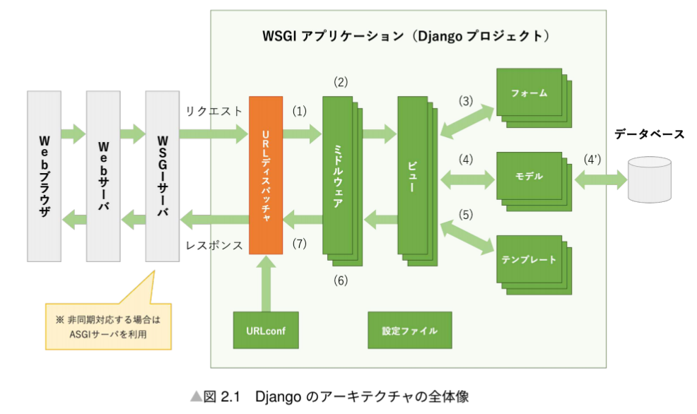

# 2.1 全体像

- djangoはWSGI(ウィスキー)アプリケーションが使われる
  - Python製のWebアプリとWebサーバを接続するためのインターフェース仕様に対応したWSGIサーバを使う

1. URLディスパッチャがURLパターンにマッチするビューを探す
2. ミドルウェアがリクエストに対する前処理を行う
3. ビューがリクエストから取得した入力値をフォームオブジェクトに変換しバリデーション
4. ビューが「モデル」オブジェクトを取得してビジネスロジックを実行する。DBにクエリが実行される
5. 取得したモデルオブジェクトやフォームオブジェクト、その他の変数の内容をテンプレートにレンダリングしてレスポンスを作成して返す
6. ミドルウェアがレスポンスに後処理をする
7. URLディスパッチャがレスポンスや例外をハンドリングする。

| 構成要素 | 慣例名 |概要|　
| ---- | ---- | ---- |
| URLconf | urls.py | URLパターンとビューのマッチング情報を保持したモジュール
| URLディスパッチャ | - | URLconfにしたがってリクエストURLに応じたビューを呼び出す。ビューからのレスポンスや例外のハンドリングも行う。
| ビュー | views.py |　モデル、フォーム、テンプレートと連携してレスポンスを作成する。
| モデル | models.py | モデルクラスとテーブルの定義を紐づけることでアプリケーションの内部のデータをオブジェクトとして扱う。ビジネスロジックはここに記述する。
| テンプレート | - |　ユーザーにどのようにデータを提示するか記述するHTMLファイル。
| フォーム | forms.py | ユーザーからの入力をオブジェクトとして扱うためのクラス
| ミドルウェア | middlewares.py |　リクエストの前処理とレスポンスの後処理を行う
| 設定ファイル | settings.py | Djangoプロジェクト全体の設定を保持するファイル

# 2.2 MTVフレームワーク
djangoを構成する要素でとくに重要なのが以下3点。開発時はこれらをコーディングする。
1. モデル
2. テンプレート
3. ビュー
これらの頭文字をとってDjangoは"MTVフレームワーク"であると呼ばれる。

- MTVフレームワーク
  - MVC(WEBの標準的なフレームワーク)とアーキテクト上の設計は変わらない。
  - M：内部データとビジネスロジックを担当。Djangoのモデルに該当。
  - V：UIへの出力を担当。DjangoのT・Vに該当。
  - C：UIからの入力を担当。URLディスパッチャが担当。
