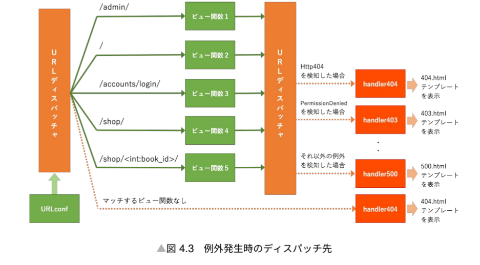

# 4.1 概要
- urls.pyはURLconfとよばれURLパターンとマッチするビュー関数のリストが登録されている
- 「URLディスパッチャ」はURLconfに登録された設定にもとづいてリクエストされたURLに対応するビュー関数を探し出して呼び出す役割をもっている
- ひな型プロジェクトのROOT_URLCONF設定は以下のようになっている
  - `ROOT_URLCONF = 'config.urls'` ※config/settings.pyに記述

# 4.2　URLconfの書き方
URLパターンは以下2通りで書ける
1. パスコンバータを使う書き方
   1. `django.urls.conf.path`関数をつかう
2. 正規表現を使う書き方
   1. `django.urls.conf.re__path`関数でマッピング

##　4.2.1 
- パスコンバータは「<パスコンバータ:変数名>」という形式で記述する。‘
- 「int」「str」「path」「slug」「uuid」の5種類がDjangoから提供されている。自作することも可能。
- 以下のように実装を行う。
```python
from django.conrtilb import admin
from django.urls import path
from accounts import views as accounts_views
from . import views

urlpatterns = [
    path('admin/',admin.site.urls),
    path('',views.index, name = index),
    path('accounrs/login', accounts_views.login, name = 'accounts_login'),
    path('shop/',shop_views.index, name = ''shop_index), # [/shop/]にマッチするもの
    path('shop/<int: book_id>/', shop_views.detail, name='shop_detail'),# [/shop/1],[/shop/123]にマッチするもの
]

class BookDetailView(View):
    def get(self, request, book_id, *args, **args) # book_idを取得する関数のイメージ

```

##　4.2.2 
- 正規表現を用いるとより柔軟にURLパターンを定義できる
- `django.urls.conf.re__path`関数を利用する。`re__path`の第一引数にはURLの正規表現を、第二引数にはURLパターンに対応するビュー関数を指定する。

## 4.2.3　注意点
1. URLパターンの左端には「/」をつけず、右端にはつけるのが通例
2. URLconfにクエリ文字列に関する記述は不要。クエリ文字列はビュー側でリクエストオブジェクトから取得することができる
3. `path()`や`re__path()`のキーワード引数として指定するnameは`urls.py`のなかでユニークであることが望ましい。重複している場合は後に登録しているものが優先される。

# 4.3 エラーハンドリング
- URLディスパッチャはマッチするビュー関数が見つからなかった場合やビュー関数から伝播された例外を検知した場合のエラーハンドリングも行える。
- アクセスされたURLがどのパターンにもマッチしていない場合
  - handler404というビューを介して404.htmlを表示する


# 4.4 ベストプラクティス2 アプリケーションごとにurls.pyを設置する

- urls.pyはアプリケーションごとに一つずつ分割することで設定の肥大化による管理工数増加を防ぐことができる
```python
from django.contrib import admin
from django,urls import include, path
from . import views

urlpatterns = [
    path('admin/', admin.site.urls),
    path('', views.index, name = 'index' ),
    path('accounts/', include('accounts.urls')),
    path('shop'/, include('shop.urls'))
]
```

- include関数を使ってアプリケーションごとにurls.pyを読み込んでいる. これにより
  - 「/accounts/」で始まるURLパターンの全てを「accounts」アプリケーションごとのaccpunts/urls.pyに集約できる
  - 「/shops/」で始まるURLパターンのすべてを「shopアプリケーションのshop/urls.pyに異常している」
- アプリケーション配下のurls.pyでは、アプリケーション内部のURLパターンの設定のみに集中できる。
- ただし、startappコマンドでは作成されないので手動で作る必要がある。
```python
from django,urls import path
from . import views

app_name = 'accounts' # アプリ名と同じにするとよい。
urlpatterns = [
    path('login/',views.login, name = 'login'),
    path('logout/', views.logout, name = 'logout' ),
    path('register/', views.register, name = 'register'),
]
```

