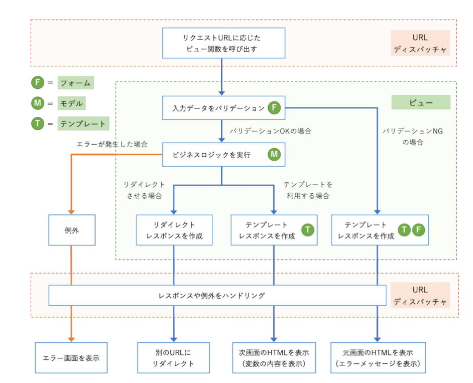

# 5.1 概要
- ビューの役割は"リクエストオブジェクトを受け取ってレスポンスオブジェクトを返す"
- ビューから例外が送出された場合はURLディスパッチャが例外をハンドリングする



上記の"次画面にHTMLコンテンツを表示する"は以下の流れ
1. URLディスパッチャからビュー関数が呼ばれる
2. フォームを使って入力データのバリデーションを行う
3. OKならビジネスロジック処理を実装する
4. 画面に表示するための変数と利用するテンプレート名をセットしたテンプレートレスポンスを作成して返す
5. URLディスパッチャがレスポンスをハンドリングする

# 5.2 ビュー関数の書き方
- ビュー関数は以下の特徴を備えている
  - 第一引数に`django.http.request.HttpRequest`オブジェクトを受け取る
  - 戻り値として`django.http.responst.HttpRequest`オブジェクトを返す
- 書き方は以下2通り
  - 関数ベース：関数で書く
  - クラスベース：クラスで書いてビュー関数に変換する

###　5.2.1 関数ベースビューの例

```python
from django.template.response import TemplateResponse

def hello(request):
    if request.method == 'GET': #　ビュー関数をGETリクエストにのみ対応させる
        context = {
            'message': 'Hello World!',
        }
        return TemplateResponse(request, 'hello.html', context) #　テンプレでHTMLコンテンツを作成
```


###　5.2.2 クラスベースビューの例
```python
from django.template.response import TemplateResponse
from django.views import View # クラスベースのビューは「`django.views.generic.base.View`」を継承する必要があるがこれでimport可能

class HelloView(View):
    def get(self, requset, *args, **kwargs):
        context = {
            'message': 'Hello World!'
        }
        return TemplateResponse(request, 'hello.html', context)

hello = Hello.View.as_view() # クラスベースなら必須だがURLconf側に記述することも可能。
```
- `request.method`がGETか否かの条件分岐は不要。代わりに`get`メソッドを定義してその中に処理を記述。

### 5.2.3 どちらがよいか
著者としては"*クラスベース*"を推奨。
- `django.views.generi.base.View`を直接継承すると見通しよいビューを作れる
- Generic View(汎用ビュー)などの様々な用途のクラスが提供されている
- お決まりの処理を再利用できる便利なMixinクラスが多数ある

# 5.3 シンプルでよく使う基本汎用ビュー

## 5.3.1 基本汎用ビューについて
- `django.views.generic.base.View`が一番基本となるクラス。
- これを継承させて様々な用途で扱う

```python
from django.contrib.auth import login as auth_login
from django.http.response import HttpResponseRedirect
from django.template.response import TemplateResponse
from django.views import View

class LoginView(View):
    def get(self, request, *args, **kwargs):
        """GETリクエストメソッド"""
        context = {
            'from': LoginForm()
        }

        # ログイン画面用のテンプレに空のフォームをレンダリング
        return TemplateResponse(request, 'accounts/login.html', context)

    def post(self, request, *args, **kwargs):
        """POSTリクエストメソッド"""

        form = LoginForm(requset.POST) # リクエストからフォームオブジェクトを作成
        if not form.is_valid(): # バリデーション: NGならログイン画面再表示
            context = {
                'form': form,
            }
            return TemplateResponse(request, 'accounts/login.html', context)

        user = form.get_user() # ユーザーオブジェクトをフォームから取得

        auth_login(request, user) # ログイン情報をセッションに保存してユーザーレコードを更新

        return HttpResponseRedirect(reverse('shop: index')) # ショップ画面を表示するためにURLにリダイレクト 

login = LoginView.as_view()
```

- リダイレクトするURLは`django.urls.reverse()`を使ってURLパターンの名前から逆引きし、ビューにはハードコーディングしないのがベター

## 5.3.2 Template View
- `django.views.generic.base.TemplateView`はテンプレート表示に特化した基本汎用ビュー
- トップ画面やヘルプ画面などの単純なテンプレート表示に利用される
- 汎用ビューにはオーバーライドできる変数・メソッドがいくつかあるためデフォルトの挙動をある程度変更できる。
```python
from django.views.generic import TemplateView

class IndexView(TemplateView):
    template_name = 'accounts/index.html'

index = IndexView.as_view()
```

- `get_context_data()`をオーバーライドしてテンプレートに渡すコンテキストに任意の変数を追加する。
```python
from django.contrib.auth import get_user_model
from django.views.generic import TemplateView

User = get_user_model()
class IndexView(TemplateView):
    
    def get_context_data(self, **kwargs):
        context = suprt().get_context_data(**kwargs)

        # テンプレートに渡すコンテキストに'user_count'という変数を追加
        context['user_count'] = User.objects.count()
        return contxt

index = IndexView.as_view()

```